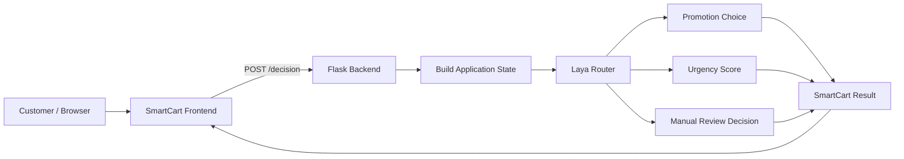

# SmartCart-Laya

A small prototype application that explores how Laya can be integrated into an application to make structured decisions from customer and order state.

This project connects a Flask backend to the Laya decision engine and presents an interactive web interface for evaluating e-commerce order conditions. The backend passes structured customer and cart data to Laya, which evaluates three distinct decision types—offering promotions, scoring order urgency, and assessing manual review needs.

---

## 1. OVERVIEW

SmartCart is a decision dashboard prototype designed to test how a decision model evaluates customer context in real time. 

The application collects:
- **Customer Information**: Student status (`is_student`), number of `previous_orders`, and `previous_returns`.
- **Cart Details**: The order `cart_total`.
- **Customer Message**: Free-text notes or special instructions provided during checkout.

When submitted, the backend structures this input into an application state dictionary and sends it to the Laya decision model (`Router.predict()`). Laya evaluates the state against predefined questions and returns three types of decisions:
- **Promotion** → `choice` decision (`student_discount`, `loyalty_discount`, or `no_discount`)
- **Order Urgency** → `score` decision (numerical scale from `0` to `10`)
- **Manual Review** → `noul` decision (boolean probability threshold determining if human review is needed)

The Flask API exposes the `/decision` endpoint, and a vanilla JavaScript frontend displays the returned decisions visually.

---

## 2. WHY I BUILT THIS

I built this project to gain practical experience integrating a decision-oriented AI model directly into a backend web application.

Rather than just reading documentation or running standalone scripts, I wanted to:
- Structure real application state (customer traits, order details, free text).
- Formulate structured questions with explicit criteria.
- Invoke Laya's prediction method programmatically.
- Inspect and format raw prediction outputs (choices, floating-point score distributions, and noul confidence levels).
- Expose the decision logic behind a REST endpoint in Flask.
- Build a browser UI to visualize decision outputs in real time.

---

## 3. HOW LAYA FITS INTO THE APPLICATION

Laya acts as the decision engine between the application state and the output response:

```
Customer State
      ↓
Decision Questions
      ↓
Laya
      ↓
Structured Decisions
      ↓
Application Response
```

Instead of hardcoding conditional `if/else` rules for every combination of customer attributes and message text, the application defines three question types evaluated by Laya:

### Choice
Used when the application must pick one option from a fixed set of possibilities.
- **Criteria**:
  - `student_discount`: Discount intended for verified students.
  - `loyalty_discount`: Discount based on prior order history.
  - `no_discount`: Standard order with no promotional discount.

### Score
Used when the application needs a bounded numerical rating.
- **Criteria**: Scale from `0` (lowest urgency) to `10` (highest urgency). Evaluated using both numerical attributes and semantic cues from the customer message.

### Noul
Used for binary (yes/no) style decisions.
- **Criteria**: Determines whether an order should be flagged for manual review based on risk signals or unusual patterns. Returns a probability value where $\ge 0.5$ triggers a `YES` flag.

---

## 4. SYSTEM ARCHITECTURE



---

## 5. PROJECT STRUCTURE & EXPERIMENT SCRIPTS

```
SmartCart-Laya/
├── app.py                 # Flask server with / and /decision endpoints
├── templates/
│   └── index.html         # SmartCart web dashboard template
├── static/
│   ├── style.css          # Modern dashboard CSS stylesheet
│   └── script.js          # Form handler and API fetch logic
├── test_laya.py           # Experiment script testing promotion choices across 3 customer profiles
├── test_score.py          # Experiment script testing urgency scoring
├── test_noul.py           # Experiment script testing manual review (noul) output
├── compare_customers.py   # Comparison script running all 3 question types across 2 customer states
└── test_all.py            # Complete pipeline test script
```

---

## 6. LOCAL SETUP & RUNNING THE APP

### Prerequisites
- Python 3.10+
- Dependencies installed in virtual environment: `flask`, `laya`

### Running the Web Dashboard

1. Activate your virtual environment and start the Flask server:
   ```bash
   python app.py
   ```
2. Open your browser and navigate to:
   ```
   http://127.0.0.1:5000/
   ```

### Running Standalone Experiment Scripts

To test individual decision types directly from the command line:
```bash
# Test promotion choice matching
python test_laya.py

# Test urgency score prediction
python test_score.py

# Test manual review threshold
python test_noul.py

# Run comparison test across multiple customer states
python compare_customers.py
```
